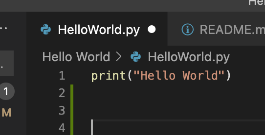
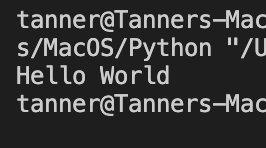

# HelloWorld.py
## Program Description:
This is a simple hello world program to help us learn more about the usage of git and git hub. The program itself displays the words "Hello World"

## How to set up development environment:
This development environment was easy to set up. We are using VS code to write and publish to GitHub. In this example we are using VS code to write in python. To accomplish this, I had to download python to my computer. After it was downloaded, I created a git folder and told it to sync with GitHub so that my files would be automatically updated. The code is as follows `print(Hello World)`

## Execution:
To run this program, download the program [HelloWorld.py](HelloWorld.py). Once you have th program run the program using your terminal or command line. Type the command `python` followed by the file name/location. Python should be downloaded previously onto your computer.

## Screenshots
Code Screenshot:

Code Output:

## Useful Websites

[CS246 Prove 01 Description](https://byui-cse.github.io/cse310-course/lesson01/01-prove.html)

[Python Website](https://www.python.org/)

